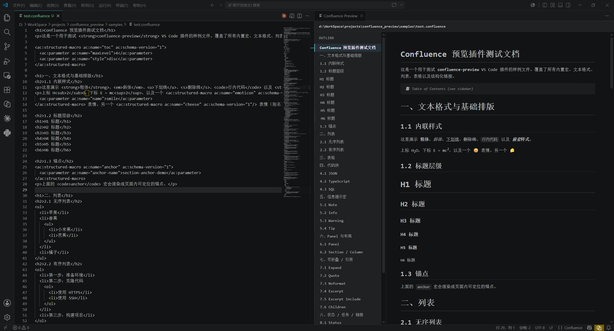
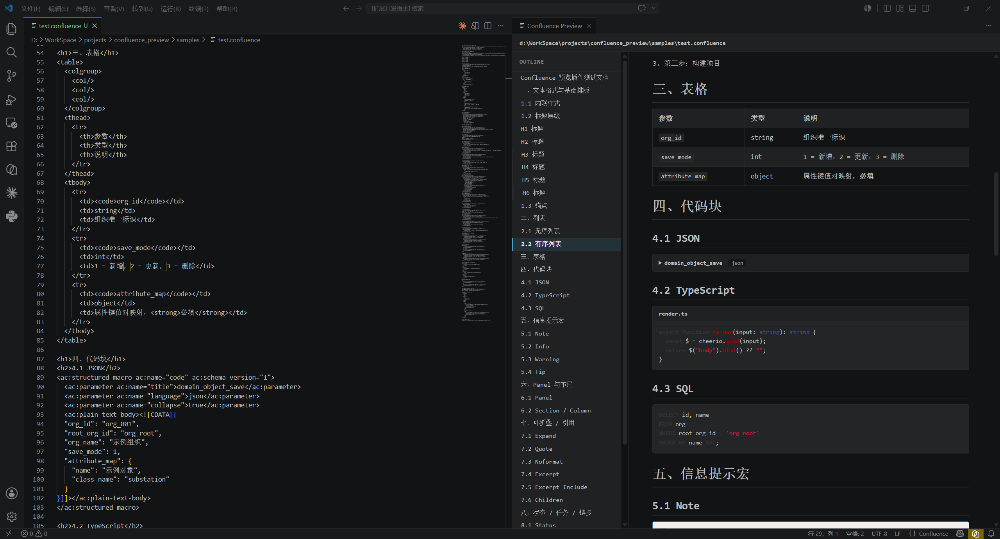
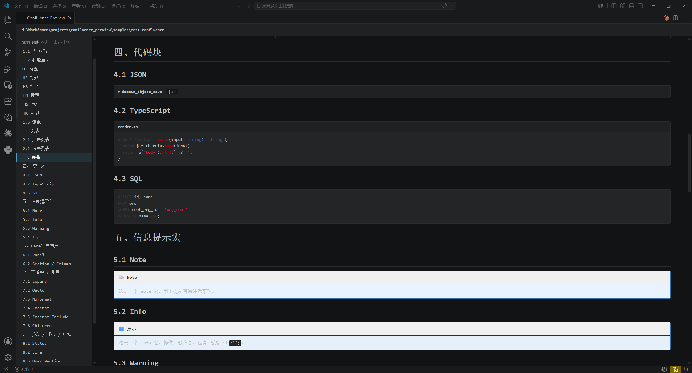
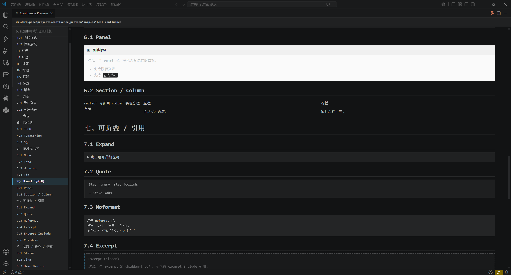
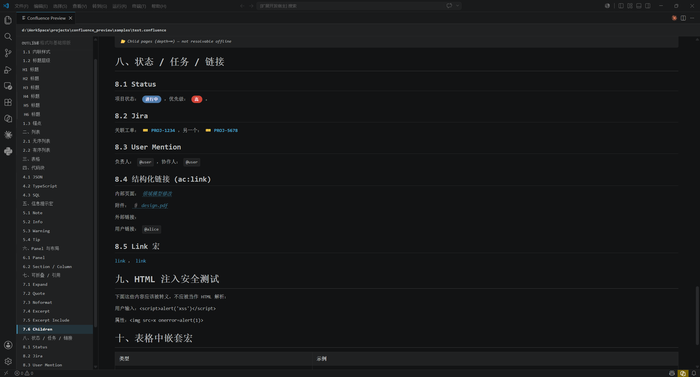

<div align="right">

**[English](./README.en.md)**

</div>

<div align="center">

# Confluence Preview

在 VS Code 里预览 Confluence 存储格式（XHTML）。

[功能特性](#功能特性) · [快速开始](#快速开始) · [命令](#命令) · [支持的元素](#支持的元素) · [常见问题](#常见问题)

[](./LICENSE)
[](https://code.visualstudio.com/)
[](https://www.typescriptlang.org/)
[](#为什么需要)
[]()

纯客户端的 VS Code 扩展。打开 `.confluence` 文件，渲染页坐在源码旁边实时刷新。不连 Confluence，不发网络请求，不埋点。


左侧源码，右侧大纲加渲染页。

</div>

---

## 为什么需要

在 Confluence Source Editor 写文档，屏幕上一堆 `<ac:structured-macro>` 标签。想看效果只能粘回 Confluence 点 Preview，瞄一眼，再回去改。这个扩展把这一步砍了：VS Code 里打开文件，渲染页就在源码旁边，每敲一个键刷一次。不用 publish，不用反复贴。

解析器完全跑在本地，飞机、地铁、内网都能用。

---

## 功能特性

| | |
|---|---|
| **并排预览**：渲染页出现在编辑器旁边，编辑或保存时自动刷新。 | **实时大纲侧边栏**：所有 `h1`–`h6` 汇总成可点击的树形结构，跟随滚动位置。 |
| **完整宏支持**：`code`、`toc`、`panel`、`note` / `info` / `warning` / `tip`、`expand`、`status`、`jira`、`user-mention`、`link` / `pagelink`、`section` / `column`、`excerpt` / `excerpt-include`、`quote`、`noformat`、`anchor`、`children`、`emoticon` / `cheese`。未知宏降级为淡色提示框。 | **代码块语法高亮**：JSON、TypeScript、SQL 等 `highlight.js` 支持的语言，跟随 VS Code 主题。 |
| **结构化链接解析**：`<ac:link>` 包裹的 `ri:page` / `ri:attachment` / `ri:url` / `ri:user` 都会渲染成对应的内联链接。 | **主题自适应**：跟随 VS Code 的亮色 / 暗色 / 高对比度主题。 |
| **XSS 安全**：所有用户输入的文本都先转义再渲染。 | **一键导出**：复制渲染后的 HTML，或将整个文档导出为 Markdown。 |

### 宏展示

| | |
|---|---|
| **代码块与表格**：可折叠面板、行号、JSON / TS / SQL 高亮。<br><br> | **彩色提示框**：`note`、`info`、`warning`、`tip`。<br><br> |
| **布局与折叠**：`panel`、`section` / `column`、`expand`、`quote`、`noformat`、`excerpt`。<br><br> | **状态、Jira、提及、链接、XSS 测试**：彩色标签、工单链接、@提及、页面 / 附件 / 用户 / 外链、转义后的 HTML。<br><br> |

---

## 快速开始

> clone 到出预览大概两分钟。

1. **装依赖 + 构建**
   ```sh
   npm install
   npm run build
   ```
2. **启动扩展**：VS Code 打开本目录，按 F5，会弹出一个新的扩展开发主机窗口。
3. **打开示例**：在新窗口里打开 `tests/test.confluence`（覆盖了所有支持的宏），按 `Ctrl+Shift+P` 选 `Confluence: Open Preview`。

然后左编辑、右预览。

---

## 文件类型

以下文件名模式注册为 `confluence` 语言：

- `*.confluence`
- `*.cfl`
- `*.confluence-storage`

`.html` 文件通过 `html` 语言兜底处理，不用重命名也能预览。

---

## 命令

| 命令 | 作用 |
|---|---|
| `Confluence: Open Preview` | 在编辑器旁边打开或聚焦预览面板 |
| `Confluence: Refresh Preview` | 强制立即重新渲染 |
| `Confluence: Copy Rendered HTML` | 复制渲染后的 HTML 到剪贴板 |
| `Confluence: Export to Markdown` | 将文档导出为尽力而为的 Markdown |

---

## 支持的元素

### 宏

| 宏 | 说明 |
|---|---|
| `code` | 支持 title、language、collapse、行号；通过 `highlight.js` 高亮 |
| `toc` / `table-of-contents` | 占位标记 + 完整侧边栏大纲 |
| `note` / `info` / `warning` / `tip` | 带图标的彩色提示框 |
| `panel` | 通过宏参数自定义标题、边框、颜色 |
| `expand` | 可折叠块（`<details>`） |
| `excerpt` / `excerpt-include` | 可复用的摘录块 |
| `quote` | 带样式的引用块 |
| `status` | 彩色标签（灰 / 绿 / 黄 / 红 / 蓝 / 紫） |
| `jira` | 工单链接（使用 `baseurl` 参数） |
| `user-mention` | @user 标签 |
| `link` / `pagelink` | 链接宏，支持内联文本 |
| `section` / `column` | flex-row 布局 |
| `noformat` | 预格式化块（保留 CDATA 原样） |
| `anchor` | 页内锚点 |
| `children` | 占位（离线环境） |
| `emoticon` / `cheese` | 表情符号 |
| *未知宏* | 淡色降级框，显示宏名 + 内容 |

### 标准 HTML

所有标准 XHTML 元素：`h1`–`h6`、`p`、`strong` / `em` / `u` / `s`、`sub` / `sup`、行内 `code`、`pre`、`blockquote`、`ul` / `ol` / `li`、`a`、`img`、`table` / `thead` / `tbody` / `tr` / `th` / `td`（colspan / rowspan）、`span`、`div`、`figure`、`figcaption`、`time`、`small`、`mark`、`cite`、`q`、`kbd`、`br`、`hr`。

### 结构化链接

- `<ac:link><ri:page ri:content-title="…"/></ac:link>` → 蓝色内联链接
- `<ac:link><ri:attachment ri:filename="…"/></ac:link>` → 📎 附件链接
- `<ac:link><ri:url ri:value="…"/></ac:link>` → 外链
- `<ac:link><ri:user ri:username="…"/></ac:link>` → @user 提及
- 文本中直接使用的 `<ri:page>` 等也会被解析

---

## 常见问题

**需要 Confluence 账号吗？**
不需要。纯本地解析器，不连任何东西，源码不出你的机器。

**离线 / 内网能用吗？**
能。没有网络请求，没有埋点，没有自动更新 ping，过得了等保和隔离网。

**内部页面 / 附件链接会跳吗？**
默认不会。扩展不知道你的 Confluence 域名，所以内部链接渲染成带标签的占位符。如果需要解析，可以在 `jira` 宏等地方设 `baseurl` 参数。

**预览不刷新怎么办？**
命令面板里跑 `Confluence: Refresh Preview`。默认是 250ms 防抖，大段粘贴后手动按一下有帮助。

**能在预览里直接编辑吗？**
不能，预览是只读的。配合 VS Code 正常编辑 `.confluence` 文件就行，Source Control 一样能用。

**想加自定义宏怎么办？**
可以，看下面的「开发者」一节。每个宏就是 `src/parser/macros/` 下的一个 TypeScript 文件，在 `registry.ts` 里登记一下就完事。

---

## 局限

- **无网络请求。** `<ac:link><ri:page .../></ac:link>` 和 `<ac:link><ri:attachment .../></ac:link>` 渲染成带标题/文件名的内联占位符，不会解析为真实 Confluence 链接（因为扩展不知道你的 Confluence 域名）。
- **不加载图片。** 外部 `` 显示为占位符，以满足 webview 的 CSP 策略并保持纯离线运行。
- **只读预览。** 编辑仍需在 Confluence 自带的 Source Editor 中进行。
- **Markdown 导出尽力而为。** 会去掉大部分标记，把宏转成最接近的 Markdown 等价物；不保证可逆。

---

<details>
<summary><h2>开发者</h2></summary>

### 架构

```
┌─────────────────────┐                ┌──────────────────────┐
│  Confluence 源码    │   parse        │  RenderContext       │
│  (XHTML + ac:/ri:)  │ ─────────────► │   - html             │
│                     │                │   - outline tree     │
└─────────────────────┘                │   - macros seen      │
                                          │   - warnings         │
                                          └─────────┬────────────┘
                                                    │ postMessage
                                                    ▼
                                          ┌──────────────────────┐
                                          │  Webview (CSP-safe)  │
                                          │   - style.css        │
                                          │   - script.js        │
                                          │   - highlight.min.js │
                                          └──────────────────────┘
```

#### 预处理：CDATA

Confluence 源码用 XML CDATA 块（`<![CDATA[ ... ]]>`）原样保留代码。浏览器 HTML 解析器把 CDATA 当成注释处理，会破坏 code 宏的 body。我们在解析前把每个 CDATA 块替换成 `<cf-cdata data-b64="…">` 占位符，然后在宏渲染器里把 base64 解码回原始文本。

#### 宏路由

`src/parser/macros/registry.ts` 把每个支持的宏名映射到一个渲染函数。每个渲染函数接收：

- 已解析的 cheerio 节点
- 共享的 `RenderContext`（用于收集大纲）
- 解析后的 `<ac:parameter>` 字典
- 渲染好的 rich-text-body HTML（或 `""`）
- 原始 CDATA 文本（或 `""`）

未知宏名走 `fallbackMacro`，显示一个带宏名和正文的淡色框。

### 项目结构

```
confluence_preview/
├── package.json              # 扩展清单 + 脚本
├── tsconfig.json
├── esbuild.config.mjs        # 打包配置（同时复制 media/）
├── .vscode/launch.json       # F5 调试配置
├── src/
│   ├── extension.ts          # 扩展入口，命令注册
│   ├── previewPanel.ts       # 预览 webview 生命周期 + 命令
│   ├── parser/
│   │   ├── index.ts          # 公开的 parseConfluence()
│   │   ├── elements.ts       # 标准 HTML 递归
│   │   ├── outline.ts        # h1–h6 大纲树构建
│   │   ├── sanitize.ts       # 转义 / slug 工具
│   │   ├── types.ts
│   │   └── macros/           # 每个宏一个渲染器
│   └── media/                # webview 资源（html, css, js, hljs）
├── image/                    # README 截图
└── tests/
    └── test.confluence       # 覆盖所有宏的完整测试
```

### 开发命令

| 命令 | 作用 |
|---|---|
| `npm install` | 安装依赖 |
| `npm run build` | 打包 `src/extension.ts` → `dist/extension.js` |
| `npm run watch` | 监听变化自动重建（F5 调试用） |
| `npm test` | 运行 Node 测试 |
| `npx tsc --noEmit` | 类型检查 |

### 加一个新宏

1. 在 `src/parser/macros/<name>.ts` 里写一个 `render<Name>Macro` 函数。
2. 在 `src/parser/macros/registry.ts` 的 `REGISTRY` 里登记。
3. 在 `tests/<name>.test.mjs` 加测试，断言生成的 HTML。
4. 跑 `npm test` + `npx tsc --noEmit` + `npm run demo`，肉眼对一下渲染结果。

</details>

---

## 许可证

MIT，见 [LICENSE](./LICENSE)。

## 致谢

- HTML 解析：[cheerio](https://cheerio.js.org/)
- 语法高亮：[highlight.js](https://highlightjs.org/)
- 适配 VS Code ≥ 1.75
