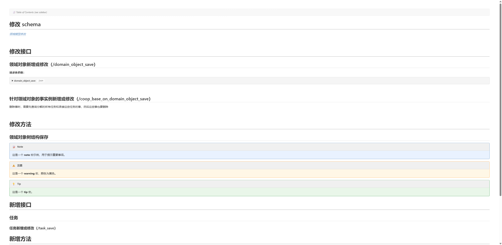

# Confluence Preview

A VS Code extension that previews **Confluence Storage Format** (the XHTML
that lives behind Confluence's *Source Editor*) as it actually appears in
the rendered Confluence page.

**Pure client-side** — no Confluence server connection required. You give it
the raw source, it gives you back the rendered page, with a sidebar
outline and full syntax-highlighted code blocks.



## What it does

Drop any Confluence source into a `.confluence` / `.cfl` file (or paste
into any `.html` file) and run `Confluence: Open Preview`. The preview
pane shows:

- All `h1`–`h6` headings with proper hierarchy
- A live **outline sidebar** that tracks your scroll position
- Fully rendered macro output for `code`, `toc`, `note`, `info`,
  `warning`, `tip`, `panel`, `expand`, `excerpt`, `quote`, `status`,
  `jira`, `user-mention`, `link`, `section/column`, `noformat`, `anchor`,
  `children`, `emoticon`, and more
- A muted fallback box for unknown macros (so you still see what's there)
- Syntax-highlighted code blocks (`code` macro + language param)
- Theme-aware styling — adapts to VS Code's light / dark / high-contrast
- Auto-refresh on edit / save
- "Copy Rendered HTML" and "Export to Markdown" commands

## Quick start

1. **Install dependencies**
   ```sh
   npm install
   ```
2. **Build the extension**
   ```sh
   npm run build
   ```
3. **Run it**: open this folder in VS Code, press **F5** to launch the
   extension in a new Extension Development Host window.
4. In that new window, open `samples/demo.confluence` and run
   `Confluence: Open Preview` from the Command Palette
   (or click the preview icon in the editor title bar).

## Usage

### File types

These filename patterns are registered as the `confluence` language:

- `*.confluence`
- `*.cfl`
- `*.confluence-storage`

(`.html` is also handled by the preview command via the `html` language
fallback, so you can preview arbitrary Confluence markup without renaming
files.)

### Commands

| Command | Description |
|---|---|
| `Confluence: Open Preview` | Opens / focuses the preview pane beside the active editor |
| `Confluence: Refresh Preview` | Force a re-render |
| `Confluence: Copy Rendered HTML` | Copy the rendered HTML to your clipboard |
| `Confluence: Export to Markdown` | Save the document as best-effort Markdown |

### Inline preview flow

1. Open a `.confluence` file in the editor.
2. Run `Confluence: Open Preview` (or click the preview icon).
3. Edit the source — the preview auto-refreshes (debounced 250ms).
4. Save the file — the preview refreshes immediately.
5. Click any heading in the outline sidebar to scroll to it.

## Supported Confluence elements

### Macros (rendered)

| Macro | Notes |
|---|---|
| `code` | title, language, collapse, linenumbers; JSON / JS / etc. highlight |
| `toc` | placeholder marker + full sidebar outline |
| `note` / `info` / `warning` / `tip` | color-coded callouts with icon |
| `panel` | customizable title / border / colors via macro params |
| `expand` | collapsible block (`<details>`) |
| `excerpt` / `excerpt-include` | reusable snippet blocks |
| `quote` | styled blockquote |
| `status` | colored pill (grey/green/yellow/red/blue/purple) |
| `jira` | issue link (uses `baseurl` param) |
| `user-mention` | @user tag |
| `link` | link macro with optional inline body |
| `section` / `column` | flex-row layout |
| `noformat` | preformatted block (preserves CDATA verbatim) |
| `anchor` | in-page anchor target |
| `children` | placeholder (offline) |
| `emoticon` / `cheese` | emoji glyphs |
| *unknown* | muted fallback box with macro name + body |

### Standard HTML

All standard XHTML elements: `h1`–`h6`, `p`, `strong`/`em`/`u`/`s`,
`sub`/`sup`, `code` (inline), `pre`, `blockquote`, `ul`/`ol`/`li`,
`a`, `img`, `table`/`thead`/`tbody`/`tr`/`th`/`td` (colspan / rowspan),
`span`, `div`, `figure`, `figcaption`, `time`, `small`, `mark`, `cite`,
`q`, `kbd`, `br`, `hr`.

### Structured links

- `<ac:link><ri:page ri:content-title="…"/></ac:link>` → blue inline link
- `<ac:link><ri:attachment ri:filename="…"/></ac:link>` → 📎 attachment link
- `<ac:link><ri:url ri:value="…"/></ac:link>` → external link
- `<ac:link><ri:user ri:username="…"/></ac:link>` → @user mention
- `<ri:page>` etc. inside text also resolved

## Architecture

```
┌─────────────────────┐                ┌──────────────────────┐
│  Confluence source  │   parse        │  RenderContext       │
│  (XHTML + ac:/ri:)  │ ─────────────► │   - html             │
│                     │                │   - outline tree     │
└─────────────────────┘                │   - macros seen      │
                                        │   - warnings         │
                                        └─────────┬────────────┘
                                                  │ postMessage
                                                  ▼
                                        ┌──────────────────────┐
                                        │  Webview (CSP-safe)  │
                                        │   - style.css        │
                                        │   - script.js        │
                                        │   - highlight.min.js │
                                        └──────────────────────┘
```

### Pre-processing

Confluence source uses XML CDATA blocks (`<![CDATA[ ... ]]>`) for
preserving code verbatim. Browsers' HTML parsers treat CDATA as comments,
which would destroy code-macro bodies. We work around this by replacing
every CDATA block with a `<cf-cdata data-b64="…">` placeholder **before**
parsing, then decoding the base64 content back to raw text inside each
macro renderer.

### Macro routing

`src/parser/macros/registry.ts` maps every supported macro name to a
renderer function. Each renderer receives:

- the parsed cheerio node,
- a shared `RenderContext` (for outline collection),
- the parsed `<ac:parameter>` map,
- the rendered rich-text-body HTML (or `""`),
- the raw CDATA text (or `""`).

Unknown macro names fall through to `fallbackMacro`, which shows a muted
box with the macro name and body.

## Project layout

```
confluence_preview/
├── package.json              # extension manifest + scripts
├── tsconfig.json
├── esbuild.config.mjs        # bundler config (also copies media/)
├── .vscode/launch.json       # F5 debug config
├── src/
│   ├── extension.ts          # extension entry, command wiring
│   ├── previewPanel.ts       # preview webview lifecycle + commands
│   ├── parser/
│   │   ├── index.ts          # public parseConfluence()
│   │   ├── elements.ts       # standard HTML recursion
│   │   ├── outline.ts        # h1–h6 outline tree builder
│   │   ├── sanitize.ts       # escape / slugify helpers
│   │   ├── types.ts
│   │   └── macros/
│   │       ├── registry.ts   # macro name → renderer
│   │       ├── code.ts / toc.ts / panel.ts / note.ts /
│   │       │   expand.ts / status.ts / excerpt.ts / quote.ts /
│   │       │   noformat.ts / children.ts / anchor.ts /
│   │       │   jira.ts / mention.ts / layout.ts / emoticon.ts /
│   │       │   link.ts / fallback.ts
│   └── media/
│       ├── preview.html      # standalone fallback shell
│       ├── style.css         # VS Code theme-aware styles
│       ├── script.js         # webview-side rendering + outline sync
│       └── highlight.min.js  # syntax highlighter (browser bundle)
├── samples/
│   └── demo.confluence       # example Confluence source
└── tests/
    ├── manual-parse.mjs      # dev smoke test
    └── demo.rendered.html    # last test output
```

## Limitations

- **No live network calls.** `<ac:link><ri:page .../></ac:link>` and
  `<ac:link><ri:attachment .../></ac:link>` render as inline placeholders
  with the title / filename; they don't resolve to real Confluence URLs
  (since this extension doesn't know your Confluence host).
- **No image loading.** External `` is shown as a placeholder to
  avoid the webview's CSP and offline-only operation.
- **No two-way editing.** This is a read-only preview. To edit, you
  still use Confluence's own Source Editor.
- **Markdown export is best-effort.** It strips most markup and turns
  macros into their nearest Markdown equivalent. Round-trip is not
  guaranteed.

## License

MIT